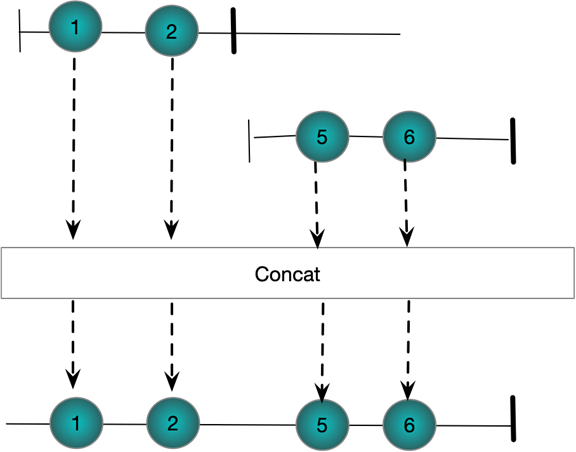

# Combining Streams CheatSheet

## Sequentially
### Observable.Concat
##### C#
```csharp
Observable.Range(0, 2)
  .Concat(Observable.Range(5, 2))
  .Subscribe(WriteLine);
```
##### Marble

### Observable.Repeat(IObservable&lt;TResult&gt;,int)
Repeat the give sequence the specified number of times

##### C#

```csharp
Observable.Range(0, 2)
 .Repeat(2)
 .Subscribe(WriteLine, () => WriteLine("OnCompleted\n"));
```
##### Marble
.png)

### StartsWith
Prepends a number of values to the beggining of a stream

##### C#
```csharp
Observable
  .Range(10, 2)
  .StartWith(8, 9)
  .Subscribe(WriteLine);
```
##### Marble


## Concurrently
### Amb
The first of a set of sequences to produce values wins and only its elements make it into the output stream

##### C#
```csharp
Subject<string> a = new Subject<string>();
Subject<string> b = new Subject<string>();

Observable.Amb(a,b)
  .Subscribe(WriteLine);

a.OnNext("a");
b.OnNext("1");
a.OnNext("b");
b.OnNext("2");
```
##### Marble

### Merge
Combines multiple streams 

##### C#
```csharp
Subject<string> a = new Subject<string>();
Subject<string> b = new Subject<string>();

Observable.Merge(a, b)
  .Subscribe(WriteLine);

a.OnNext("a");
b.OnNext("1");
a.OnNext("b");
b.OnNext("2");
```
##### Marble

### Switch
Works on a stream of streams. When the first stream starts
publishing its events are published into the result stream until the second stream starts publishing. At which point the first stream is ubseubscribed

##### C#
```csharp
Subject<string> a = new Subject<string>();
Subject<string> b = new Subject<string>();

Subject<Subject<string>> master = new Subject<Subject<string>>();

master.Switch()
 .Subscribe(WriteLine);

master.OnNext(a);
a.OnNext("a");
a.OnNext("b");
master.OnNext(b);
b.OnNext("1");
b.OnNext("2");
a.OnNext("c");
```
##### Marble


## Pairing
### CombineLatest
Combines the latest value from two streams as each stream
produces new values. Requires that each stream has at least one value before anything is published to the result

##### C#
```csharp
Subject<string> a = new Subject<string>();
Subject<string> b = new Subject<string>();

Observable.CombineLatest(a,b,(s, s1) => $"({s},{s1})")
 .Subscribe(WriteLine);

a.OnNext("a");
a.OnNext("b");
b.OnNext("1");
b.OnNext("2");
a.OnNext("c");
```
##### Marble

### Zip
Pairs together values from two streams. 

##### C#
```csharp
Subject<string> a = new Subject<string>();
Subject<string> b = new Subject<string>();

Observable.Zip(a,b,(s, s1) => $"({s},{s1})")
 .Subscribe(WriteLine);

a.OnNext("a");
a.OnNext("b");
b.OnNext("1");
b.OnNext("2");
a.OnNext("c");
```
##### Marble


### And/Then/When
Pairs together values from ,multiple streams. 

##### C#
```csharp
IObservable<int> a = Observable.Range(1, 3);
IObservable<int> b = Observable.Range(1, 3).Select(x => x * 2);
IObservable<int> c = Observable.Range(1, 3).Select(x => x * 3);

Observable
 .When(a
    .And(b)
    .And(c)
    .Then((x, y, z) => (x, y, z)))
 .Subscribe(x => WriteLine(x));

// Verbose form to show what is happening
Pattern<int, int> pattern1 = a.And(b);
Pattern<int, int, int> pattern2 = pattern1.And(c);
Plan<(int, int, int)> then = pattern2.Then((i, i1, i2) => (i, i1, i2));
IObservable<(int, int, int)> observable = Observable.When(then);
            observable.Subscribe(x => WriteLine(x));
```
##### Marble


