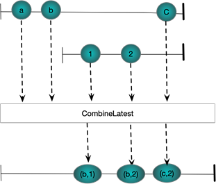

## Observable.Repeat(TResult,int)
Repeat the give value a specified number of times

##### C#

```csharp
Observable.Repeat(2,3)
  .Subscribe(WriteLine, () => WriteLine("OnCompleted\n"));
```
##### Marble
.png)

## Observable.Repeat(IObservable&lt;TResult&gt;,int)
Repeat the give sequence the specified number of times

##### C#

```csharp
Observable.Range(0, 2)
 .Repeat(2)
 .Subscribe(WriteLine, () => WriteLine("OnCompleted\n"));
```
##### Marble
.png)


## Scan(TAccumulate,Func<TAccumulate, TSource, TAccumulate>)
An accumulator which produces a sequence of accumulated values
##### C#
```csharp
Observable.Range(1, 3)
 .Scan(0,(cum, i1) => cum+i1)
 .Subscribe(WriteLine, () => WriteLine("OnCompleted\n"));
```
##### Marble


## SelectMany
SelectMany seems to work by taking an observable sequence and using each value from that sequence to generate another sequence. The generated sequences are then merged (flattened) together
##### C#
```csharp
Subject<int>[] subs = new Subject<int>[]
{
  new Subject<int>(), 
  new Subject<int>() 
};

Observable
 .Range(0, 2)
 .SelectMany(i => subs[i])
 .Subscribe(WriteLine);

  subs[0].OnNext(1);
  subs[1].OnNext(2);
  subs[0].OnNext(3);
  subs[1].OnNext(4);
```
##### Marble


## Concat

##### C#
```csharp
Observable.Range(0, 2).Concat(Observable.Range(5, 2))
                .Subscribe(WriteLine);
```
##### Marble


## StartsWith
Prepends a number of values to the beggining of a stream

##### C#
```csharp
Observable
  .Range(10, 2)
  .StartWith(8, 9)
  .Subscribe(WriteLine);
```
##### Marble


## Amb
The first of a set of sequences to produce values wins and only its elements make it into the output stream

##### C#
```csharp
Subject<string> a = new Subject<string>();
Subject<string> b = new Subject<string>();

Observable.Amb(a,b)
  .Subscribe(WriteLine);

a.OnNext("a");
b.OnNext("1");
a.OnNext("b");
b.OnNext("2");
```
##### Marble


## Merge
Combines multiple streams 

##### C#
```csharp
Subject<string> a = new Subject<string>();
Subject<string> b = new Subject<string>();

Observable.Merge(a, b)
  .Subscribe(WriteLine);

a.OnNext("a");
b.OnNext("1");
a.OnNext("b");
b.OnNext("2");
```
##### Marble


## Switch
Works on a stream of streams. When the first stream starts
publishing its events are published into the result stream until the second stream starts publishing. At which point the first stream is ubseubscribed

##### C#
```csharp
Subject<string> a = new Subject<string>();
Subject<string> b = new Subject<string>();

Subject<Subject<string>> master = new Subject<Subject<string>>();

master.Switch()
 .Subscribe(WriteLine);

master.OnNext(a);
a.OnNext("a");
a.OnNext("b");
master.OnNext(b);
b.OnNext("1");
b.OnNext("2");
a.OnNext("c");
```
##### Marble


## CombineLatest
Combines the latest value from two streams as each stream
produces new values. Requires that each stream has at least one value before anything is published to the result

##### C#
```csharp
Subject<string> a = new Subject<string>();
Subject<string> b = new Subject<string>();

Observable.CombineLatest(a,b,(s, s1) => $"({s},{s1})")
 .Subscribe(WriteLine);

a.OnNext("a");
a.OnNext("b");
b.OnNext("1");
b.OnNext("2");
a.OnNext("c");
```
##### Marble


## Zip
Pairs together values from two streams. 

##### C#
```csharp
Subject<string> a = new Subject<string>();
Subject<string> b = new Subject<string>();

Observable.Zip(a,b,(s, s1) => $"({s},{s1})")
 .Subscribe(WriteLine);

a.OnNext("a");
a.OnNext("b");
b.OnNext("1");
b.OnNext("2");
a.OnNext("c");
```
##### Marble


## And/Then/When
Pairs together values from ,multiple streams. 

##### C#
```csharp
IObservable<int> a = Observable.Range(1, 3);
IObservable<int> b = Observable.Range(1, 3).Select(x => x * 2);
IObservable<int> c = Observable.Range(1, 3).Select(x => x * 3);

Observable
 .When(a
    .And(b)
    .And(c)
    .Then((x, y, z) => (x, y, z)))
 .Subscribe(x => WriteLine(x));

// Verbose form to show what is happening
Pattern<int, int> pattern1 = a.And(b);
Pattern<int, int, int> pattern2 = pattern1.And(c);
Plan<(int, int, int)> then = pattern2.Then((i, i1, i2) => (i, i1, i2));
IObservable<(int, int, int)> observable = Observable.When(then);
            observable.Subscribe(x => WriteLine(x));
```
##### Marble


## Buffer(int)
Consider the following code which highlights the use of **Buffer(int)** to transform an observable sequence of int into an observable sequence of list of int. We consider each List<int> a buffer. 


##### C#
```csharp
SimpleObservable<int> myObservable = new SimpleObservable<int>();
IObservable<IList<int>> buffered = myObservable.Buffer(2);

buffered.Subscribe(ints => Console.WriteLine(string.Join(",", ints)));

myObservable.Publish(1);
myObservable.Publish(2);
myObservable.Publish(3);
myObservable.Publish(4);
myObservable.Publish(5);
myObservable.Complete();
```
The following figure shows graphically what is happening. The buffers contain at most Count items. Notice the final buffer has less than two items because we invoke Complete on the source observable. 
##### Marble Diagram
.png)

## Buffer(Func<IObservable<TClosingSelector>> ClosingSelector)
Whenever we publish a value from the closing selector observable the buffer will take whatever it has and flush it out. It does not really seem to matter what the value or type of the buffer close event is

##### C#
```csharp
SimpleObservable<int> myObservable = new SimpleObservable<int>();
SimpleObservable<string> closingObs = new SimpleObservable<string>();

IObservable<string> ClosingSelector() => closingObs;
IObservable<IList<int>> buffered = myObservable.Buffer(ClosingSelector);
buffered.Subscribe(ints => Console.WriteLine(string.Join(",", ints)));

myObservable.Publish(1);
closingObs.Publish("Close Second");
myObservable.Publish(2);
myObservable.Publish(3);
myObservable.Publish(4);
closingObs.Publish("Close Second");
myObservable.Publish(5);
myObservable.Complete();
```

##### Marble Diagram
.png)

## Buffer(int count,int skip)

```csharp           
SimpleObservable<int> sourceObs = new SimpleObservable<int>();

// Buffers will be started on the 1st, 4th, 7th element. Each buffer 
// will have two elements. 
IObservable<IList<int>> buffer = sourceObs.Buffer(2, 3);
buffer.Subscribe( ints => Console.WriteLine(string.Join(",",ints)));

sourceObs.Publish(1);
sourceObs.Publish(2);
sourceObs.Publish(3);
sourceObs.Publish(4);
sourceObs.Publish(5);
sourceObs.Publish(6);
```
.png)
