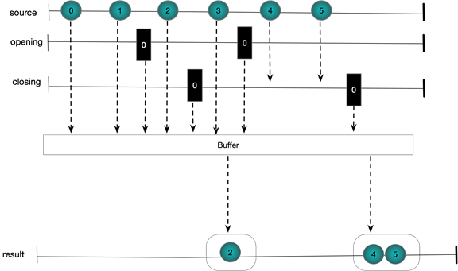

# Time Shifting CheatSheet

## Buffering 
The various overloads of Buffer enable one to group together elements from an input stream. The resulting groups are called buffers. The basic idea then is to take a stream IObservable<T> and produce a stream IObservable<IList<T>>. Buffers can be perfectly contiguous with every source element existing in one and only one result buffer; skipping with some source elements being completely left out of the result bugffers or overlapping where some source elements make it into more than once destination buffer.

*Buffering Behaviour*
* Perfectly contiguous 
* Overlapping
* Skipping

 Buffers can be defined by source element count, time interval or via open and close signals.

*Buffer Definition*
* Source element count
* time interval
* opening and closing signals


### Buffer(int count)
Supports perfectly contiguous buffers in the result stream

*C# Sample Code*
```csharp
Observable
 .Range(0, 5)
 .Buffer(2)
 .Subscribe(ints => WriteLine(string.Join(",", ints)));
```
*Output*
```
1,2
4,5
```

The following figure shows graphically what is happening. Each buffer contains at most count items. Notice the final buffer has less than two items because the source stream completes

*Marble Diagram*

.png)


## Buffer(int count,int skip)
By taking two integer arguments this overload of Buffer supports non-contiguous result buffers. Skip defines the number of elements between each buffer opening and count defines the maximum number of elements in each buffer. If skip is more than count then we miss out some source elements from the destination. If skip is less than count then we have overlapping buffers with some elements making it into more than one buffer. Of course if skip is equal to count we have the exact same behaviour as Buffer(int count), that is to say perfectly contiguous buffers. Let us look at each case in turn

#### Skipping Elements
We set the count to 2 and the skip to 3. A new buffer is started every three elements and hold at most 2 elements.

*C# Sample Code*
```csharp           
Observable.Range(1, 5)
 .Buffer(2, 3)
 .Subscribe(ints => WriteLine(string.Join(",", ints)));
```
*Output*
```
1,2
4,5
```

*Marble Diagram*

.png)

#### Overlapping Elements
We set the count to 3 and the skip to 2. A new buffer is started every two elements and hold at most three elements. The last element from each buffer is also duplicated as the first element in the next buffer

*C# Sample Code*
```csharp           
Observable.Range(1, 5)
 .Buffer(3, 2)
 .Subscribe(ints => WriteLine(string.Join(",", ints)));
```
*Output*
```
1,2,3
3,4,5
5
```
*Marble Diagram*

.png)

### Buffer(Timespan timeSpan)
Partitions each element of a source stream into contiguous buffers in the result stream. The buffers in the result stream are defined by the timing of events in the source stream.

*C# Sample Code*
```csharp    
EventWaitHandle ewh = new AutoResetEvent(false);

Observable
 .Interval(TimeSpan.FromSeconds(0.3))
 .Take(6)
 .Buffer(TimeSpan.FromSeconds(1.0))
 .Subscribe(ints => WriteLine(string.Join(",", ints)),()=>ewh.Set());

 ewh.WaitOne();
```
*Output*
```
0,1,2
3,4,5
```

*Marble Diagram*

.png)

### Buffer(Timespan timeSpan, TimeSpan timeshift)
As with using Buffer(int,int) this overloads support overlapping and skipping elements by specifying two TimeSpans. We consider each in turn

#### Overlapping Elements
*C# Sample Code*
```csharp    
EventWaitHandle ewh = new AutoResetEvent(false);
Observable
 .Interval(TimeSpan.FromSeconds(0.3))
 .Take(6)
 .Buffer(TimeSpan.FromSeconds(1.0), TimeSpan.FromSeconds(0.4))
 .Subscribe(ints => WriteLine(string.Join(",", ints)), () => ewh.Set());

 ewh.WaitOne();
```
*Output*
```
0,1,2
1,2,3
2,3,4
3,4,5
5
```
*Marble Diagram*

.png)


### Buffer(Func<IObservable<TClosingSelector>> ClosingSelector)
Whenever we publish a value from the closing selector observable the buffer will take whatever it has and flush it out. It does not really seem to matter what the value or type of the buffer close event is

##### C#
```csharp
EventWaitHandle latch = new AutoResetEvent(false);

var obs = Observable
 .Interval(TimeSpan.FromSeconds(0.3))
 .Take(10);

var closing = Observable
 .Interval(TimeSpan.FromSeconds(1.0))
 .Take(2);

 obs
  .Buffer(closing)
  .Subscribe(ints => WriteLine(string.Join(",", ints)),()=>latch.Set());

latch.WaitOne();
```
##### Marble Diagram
.png)

### Buffer(IObservable<TBufferOpening> bufferOpenings, Func<TBufferOpening, IObservable<TBufferClosing>> bufferClosingSelector)
This form of the function uses sequences to determin the buffer openings and closings
##### C#
```csharp
EventWaitHandle latch = new AutoResetEvent(false);

var obs = Observable
 .Interval(TimeSpan.FromSeconds(0.3))
 .Take(10);

var opening = Observable
 .Interval(TimeSpan.FromSeconds(0.7))
 Take(2);

var closing = Observable
 .Timer(TimeSpan.FromSeconds(0.5))
 .Take(2);

obs
 .Buffer(opening, i => closing)
 .Subscribe(ints => WriteLine($"({string.Join(",", ints)})"), () => latch.Set());

latch.WaitOne();
```
##### Marble Diagram



