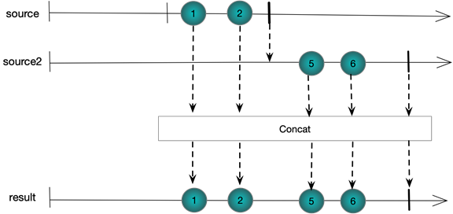
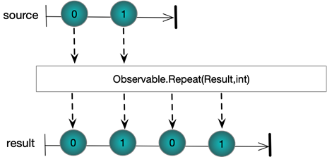
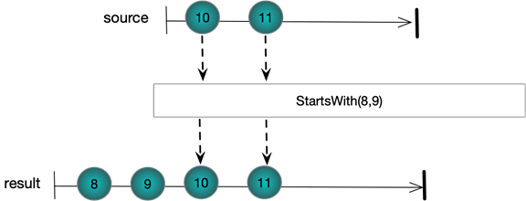
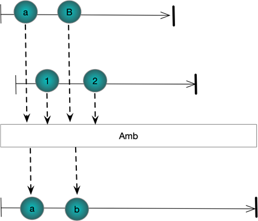
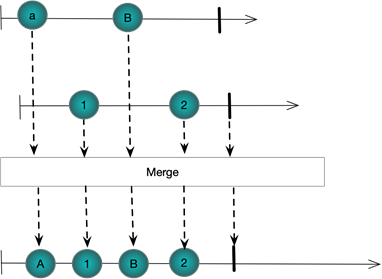

# Combining Streams CheatSheet

## Sequentially
### Observable.Concat(IObservable<TSource>)
*C# Sample Code*
```csharp
Observable
  .Range(0, 2)
  .Concat(Observable.Range(5, 2))
  .Subscribe(WriteLine);
```
*Output*
```
1
2
5
6
```

*Marble Diagram*


### Observable.Repeat(int reps)
*C# Sample Code*
```csharp
Observable
 .Range(0, 2)
 .Repeat(2)
 .Subscribe(WriteLine, () => WriteLine("OnCompleted\n"));
```
*Output*
```
0
1
0
1
OnCompleted
```

*Marble Diagram*


### Starts With
*C# Sample Code*
```csharp
Observable
 .Range(10, 2)
 .StartWith(8, 9)
 .Subscribe(WriteLine);
```
*Output*
```
8
9
10
11
```

*Marble Diagram*



### Observable.Amb
*C# Sample Code*
```csharp
Subject<string> a = new Subject<string>();
Subject<string> b = new Subject<string>();

Observable.Amb(a,b)
  .Subscribe(WriteLine);

a.OnNext("a");
b.OnNext("1");
a.OnNext("b");
b.OnNext("2");
```
*Output*
```
a
b
```

*Marble Diagram*


### Merge
*C# Sample Code*
```csharp
Subject<string> a = new Subject<string>();
Subject<string> b = new Subject<string>();

Observable.Merge(a, b)
  .Subscribe(WriteLine);

a.OnNext("a");
b.OnNext("1");
a.OnNext("b");
b.OnNext("2");
```
*Output*
```
a
1
b
2
```

*Marble Diagram*



### 
*C# Sample Code*
```csharp

```
*Output*
```

```

*Marble Diagram*


### 
*C# Sample Code*
```csharp

```
*Output*
```

```

*Marble Diagram*


