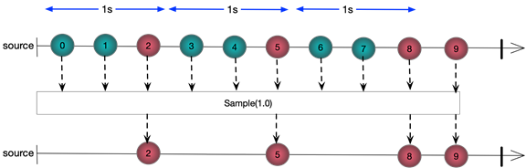

# Sample
Returns the last element emitted by a source sequence in a buffer interval specified by a TimeSpan

### Sample(TimeSpan timeSpan)


*C# Sample Code*
```csharp
DateTime now = DateTime.Now;
EventWaitHandle waitHandle = new AutoResetEvent(false);

Observable
 .Interval(TimeSpan.FromSeconds(0.3))
 .Take(10)
 .Sample(TimeSpan.FromSeconds(1.0))
 .Subscribe(l => Console.WriteLine($"Delayed {l}   {(DateTime.Now - now).TotalSeconds}"), () => waitHandle.Set());

waitHandle.WaitOne();
```
*Output*

```
Delayed 2   1.1075141
Delayed 5   2.1179985
Delayed 8   3.1327291
Delayed 9   4.1504981
```


*Marble Diagram*

